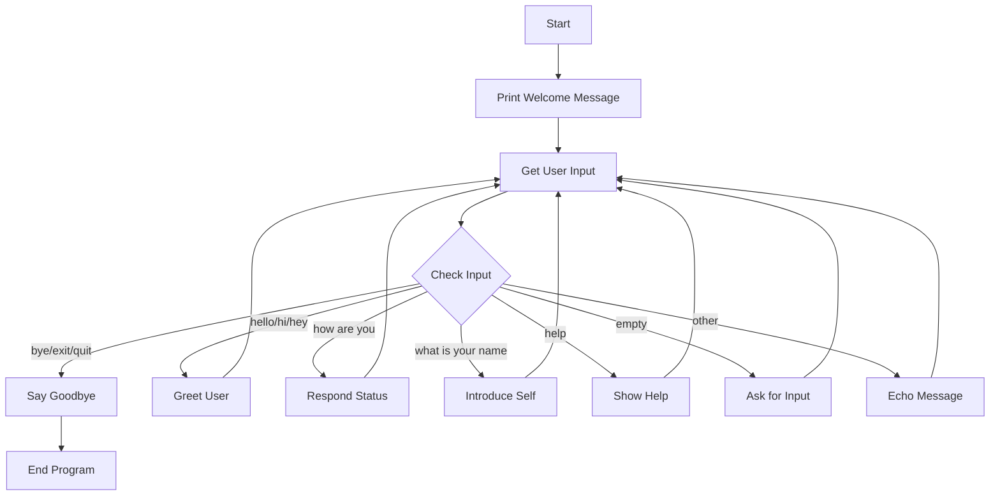

# 🤖 Simple Python Chatbot Documentation

> **A beginner-friendly chatbot built with Python**  
> *Created for learning variables, functions, and conditional statements*

---

## 📋 Table of Contents

1. [Overview](#overview)
2. [Features](#features)
3. [Installation](#installation)
4. [Usage](#usage)
5. [Code Explanation](#code-explanation)
6. [Commands Reference](#commands-reference)
7. [Learning Concepts](#learning-concepts)
8. [Troubleshooting](#troubleshooting)

---

## 🎯 Overview

This chatbot is a **simple conversational program** designed for Python beginners. It demonstrates fundamental programming concepts including:

- Variables
- Functions
- If/Else statements
- While loops
- String manipulation

### Project Information

| Property | Value |
|----------|-------|
| **File Name** | `copilot_demo.py` |
| **Language** | Python 3.x |
| **Difficulty** | Beginner |
| **Lines of Code** | ~40 |
| **Author** | OIM6301 Student |

---

## ✨ Features

### Current Capabilities

- ✅ **Continuous Conversation** - Keeps chatting until you say goodbye
- ✅ **Multiple Greetings** - Responds to "hello", "hi", and "hey"
- ✅ **Question Handling** - Answers questions about itself
- ✅ **Help System** - Type "help" for available commands
- ✅ **Graceful Exit** - Say "bye", "exit", or "quit" to end
- ✅ **Case Insensitive** - Works with UPPERCASE, lowercase, or MiXeD

### Future Enhancements

- [ ] Add more conversation topics
- [ ] Remember user's name
- [ ] Add sentiment analysis
- [ ] Integrate with AI APIs

---

## 💾 Installation

### Prerequisites

Make sure you have **Python 3.6+** installed on your system.

```bash
python --version
```

### Setup Steps

1. **Clone or download** the repository
2. **Navigate** to the project folder
3. **Run** the chatbot

```bash
cd c:\GitHub\OIM6301\2025Fall\OIM6301
python copilot_demo.py
```

> **Note:** No external libraries required! This uses only Python's built-in functions.

---

## 🚀 Usage

### Starting the Chatbot

Simply run the Python file:

```bash
python copilot_demo.py
```

### Example Conversation

```
Chatbot: Hello! I'm a friendly chatbot. Type 'bye' to exit.
--------------------------------------------------
You: hello
Chatbot: Hello there! How are you doing today?
You: how are you
Chatbot: I'm doing great, thank you for asking! How about you?
You: what is your name
Chatbot: My name is ChatBot! Nice to meet you!
You: bye
Chatbot: Goodbye! Have a great day!
```

---

## 🔍 Code Explanation

### Main Function Structure

```python
def chat_with_user():
    """A simple chatbot that responds to user input"""
```

The entire chatbot is contained in **one function** called `chat_with_user()`.

### Key Components

#### 1. Welcome Message

```python
print("Chatbot: Hello! I'm a friendly chatbot. Type 'bye' to exit.")
print("-" * 50)
```

- Greets the user
- `"-" * 50` creates a decorative line separator

#### 2. Main Loop

```python
while True:
    user_input = input("You: ").lower()
```

- **`while True:`** - Infinite loop that keeps the conversation going
- **`input()`** - Gets text from the user
- **`.lower()`** - Converts to lowercase for easier matching

#### 3. Conditional Responses

The chatbot uses **if/elif/else** statements to respond:

| Condition | Response Type |
|-----------|---------------|
| `if user_input == "bye"` | Exit the program |
| `elif user_input == "hello"` | Friendly greeting |
| `elif user_input == "how are you"` | Status update |
| `elif user_input == "help"` | Show available commands |
| `else` | Default response |

#### 4. Break Statement

```python
if user_input == "bye" or user_input == "exit" or user_input == "quit":
    print("Chatbot: Goodbye! Have a great day!")
    break
```

The **`break`** keyword exits the `while` loop and ends the program.

#### 5. Program Entry Point

```python
if __name__ == "__main__":
    chat_with_user()
```

This ensures the chatbot only runs when you execute the file directly.

---

## 📖 Commands Reference

### Supported Commands

| Input | Chatbot Response |
|-------|------------------|
| `hello`, `hi`, `hey` | Friendly greeting |
| `how are you` | "I'm doing great..." |
| `what is your name` | "My name is ChatBot!" |
| `help` | Shows available commands |
| `bye`, `exit`, `quit` | Ends the conversation |
| *anything else* | Echoes your message |

### Command Examples

```python
# Greeting commands
"hello"  # → "Hello there! How are you doing today?"
"HI"     # → "Hello there! How are you doing today?"
"Hey"    # → "Hello there! How are you doing today?"

# Information commands
"what is your name?"  # → "My name is ChatBot! Nice to meet you!"
"help"                # → Shows help message

# Exit commands
"bye"    # → Ends conversation
"EXIT"   # → Ends conversation
"Quit"   # → Ends conversation
```

---

## 📚 Learning Concepts

### 1. Variables

Variables store data that can be used later:

```python
user_input = input("You: ").lower()
```

- `user_input` is a **variable**
- It stores whatever the user types
- We can use it in if statements and print statements

### 2. Functions

Functions are reusable blocks of code:

```python
def chat_with_user():
    # All chatbot code goes here
```

**Benefits:**
- Organizes code
- Makes it reusable
- Easier to understand

### 3. If/Else Statements

Makes decisions based on conditions:

```python
if user_input == "hello":
    print("Hello there!")
elif user_input == "bye":
    print("Goodbye!")
else:
    print("I don't understand")
```

### 4. While Loops

Repeats code until a condition is met:

```python
while True:
    # This code repeats forever...
    if user_input == "bye":
        break  # ...until we break out
```

### 5. String Methods

Python has built-in methods for text:

- `.lower()` - Converts to lowercase
- `.upper()` - Converts to UPPERCASE
- `.strip()` - Removes spaces

---

## 🛠️ Troubleshooting

### Common Issues

#### Problem: Chatbot doesn't respond to my input

**Solution:** Make sure you're typing exactly as shown. The chatbot is case-insensitive, but spelling matters!

```python
✅ "hello"        # Works
✅ "HELLO"        # Works
❌ "helo"         # Doesn't work (typo)
❌ "hi there"     # Doesn't work (not exact match)
```

#### Problem: Can't exit the chatbot

**Solution:** Type one of these exit commands:

- `bye`
- `exit`
- `quit`

Or press `Ctrl + C` to force quit.

#### Problem: Empty input causes weird behavior

**Solution:** The chatbot handles this! It will say:

```
Chatbot: You didn't say anything. Please type something!
```

---

## 🎓 Exercises for Practice

### Beginner Level

1. **Add a new greeting:**
   - Make the bot respond to "good morning"
   
2. **Add your name:**
   - Make the bot introduce itself with your chosen name

3. **Add a joke:**
   - When user types "joke", tell a funny joke

### Intermediate Level

4. **Ask for user's name:**
   - Store it in a variable
   - Use it in responses: "Hello, [name]!"

5. **Count messages:**
   - Keep track of how many messages the user sent
   - Display count when exiting

6. **Add time-based greeting:**
   - Import `datetime` module
   - Say "Good morning/afternoon/evening" based on time

---

## 📝 Code Snippet Examples

### Adding a New Response

```python
elif user_input == "tell me a joke":
    print("Chatbot: Why do programmers prefer dark mode?")
    print("Chatbot: Because light attracts bugs! 😄")
```

### Storing User's Name

```python
elif user_input.startswith("my name is "):
    user_name = user_input.replace("my name is ", "")
    print(f"Chatbot: Nice to meet you, {user_name}!")
```

### Adding Multiple Keywords

```python
elif "weather" in user_input or "temperature" in user_input:
    print("Chatbot: I can't check the weather, but I hope it's nice!")
```

---

## 🌟 Best Practices Demonstrated

1. **Clear Comments** - Code is well-documented
2. **Meaningful Variable Names** - `user_input` is clear and descriptive
3. **Function Organization** - All logic in one function
4. **User Feedback** - Always responds to user
5. **Error Handling** - Handles empty input gracefully

---

## 📊 Flow Diagram



---

## 🔗 Additional Resources

### Learn More About:

- [Python Official Tutorial](https://docs.python.org/3/tutorial/)
- [W3Schools Python](https://www.w3schools.com/python/)
- [Real Python Tutorials](https://realpython.com/)

### Related Topics:

- **Natural Language Processing (NLP)** - For smarter chatbots
- **Regular Expressions** - For pattern matching
- **APIs** - For AI-powered responses (OpenAI, etc.)

---

## 📄 License

This project is created for **educational purposes** as part of the OIM6301 course.

---

## 🤝 Contributing

Want to improve this chatbot? Here are some ideas:

1. Fork the project
2. Create a new feature
3. Test your changes
4. Share with classmates!

---

## ❓ FAQ

### Q: Can I add my own responses?

**A:** Yes! Just add more `elif` statements with your custom logic.

### Q: Does this need internet?

**A:** No! It runs completely offline.

### Q: Can I use this for my homework?

**A:** Absolutely! That's what it's for. Just make sure to understand the code.

### Q: How do I make it smarter?

**A:** You can integrate AI APIs like OpenAI's ChatGPT or use NLP libraries like NLTK or spaCy.

---

## 📞 Contact & Support

- **Course:** OIM6301
- **Repository:** [GitHub - OIM6301](https://github.com/OIM6301)
- **Year:** 2025 Fall

---

> **Happy Coding! 🎉**  
> *Remember: Every expert was once a beginner. Keep practicing!*

---

**Last Updated:** November 4, 2025  
**Version:** 1.0  
**Status:** ✅ Active
